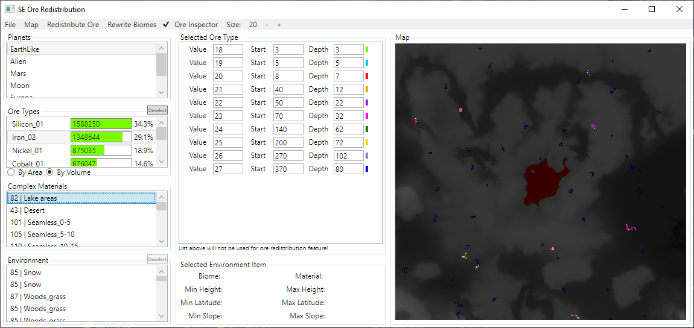

# SpaceEngineersTools

## SpaceEngineersOreRedistribution:
This is a viewer for the planet definition files, specifically ore.

Default ore distribution in SE follows a fixed pattern as seen here:

This is nice for new players because they can find anything they need within 5km.
I wanted to add more randomness and motivate exploration. This tool can generate new material maps with randomized ores and a XML file with the corresponding ore mappings. These files can be used to create a modded planet. Creating a mod is still a manual process.

Screenshot of a modded planet:

The program takes a list of ore types to spawn and lets you change some variables to influence the size and depth of the ore veins. I might add additional parameters later. I need balance the probabilities a bit more.

Currently 9-10 different ore depths will be generated and used. The veins contain more ore than in the vanilla game as a compensation for the more hard to find ore.

## SeAdminHelper

Tools restarting and stopping an Space Engineers server.

- Watchdog: Restarts server if it is not running anymore.
- Server Stopper: Shuts down server after specified time and notifies players via ingame chat.

For more info read the README of that project.

## PlanetCreator
This is an attempt in generating procedural height maps for new planets. It's still work in progress.
The map is generated using simplex noise. After that hydraulic erosion is performed.
WIP: As next feature I will try to generate lakes and generate files for the material maps.

